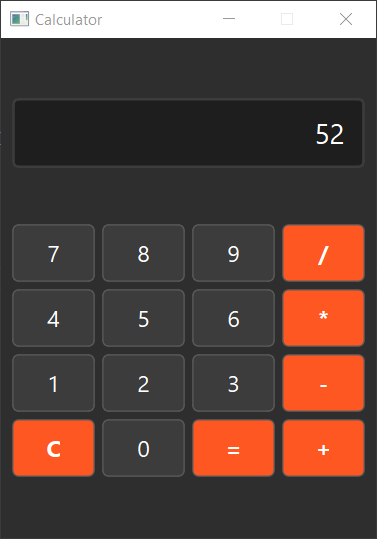

# 🧮 GUI Calculator

A simple calculator application built using Python and PyQt6. This project demonstrates the **Model-View-Controller (MVC)** design pattern, separating the logic (model), user interface (view), and interaction logic (controller).

---

## 📚 Classes Overview

### 1. `Calculator` (Model) 🧠
The `Calculator` class handles the core logic of the calculator, such as managing the expression and performing calculations.

#### **Attributes**:
- `expression`: A string that stores the current mathematical expression.

#### **Methods**:
- `__init__()`: Initializes the calculator with an empty expression.
- `add_to_expression(char)`: Adds a character (number, operator, etc.) to the current expression.
- `remove_last_character()`: Removes the last character from the expression (useful for backspace functionality).
- `clear_expression()`: Clears the entire expression.
- `calculate()`: Evaluates the current expression and returns the result. Handles errors like division by zero.
- `get_expression()`: Returns the current expression as a string.

---

### 2. `Window` (View) 🖥️
The `Window` class defines the graphical user interface (GUI) of the calculator. It uses PyQt6 widgets to create the display and buttons.

#### **Attributes**:
- `display`: A `QLineEdit` widget that shows the current expression or result.
- `buttons`: A list of `QPushButton` widgets representing the calculator buttons (numbers, operators, etc.).
- `button_layout`: A `QGridLayout` to arrange the buttons in a grid.

#### **Methods**:
- `__init__()`: Initializes the main window, sets up the layout, and creates the display and buttons.
- `update_display(text)`: Updates the display with the given text.

---

### 3. `CalculatorController` (Controller) 🎮
The `CalculatorController` class connects the model (`Calculator`) and the view (`Window`). It handles user interactions and updates the view based on changes in the model.

#### **Attributes**:
- `model`: An instance of the `Calculator` class.
- `view`: An instance of the `Window` class.

#### **Methods**:
- `__init__(model, view)`: Initializes the controller with the model and view, and connects button signals to appropriate methods.
- `connect_signals()`: Connects the `clicked` signals of the buttons to the `handle_button_click` method.
- `handle_button_click(text)`: Handles button clicks:
  - Calls `add_to_expression()` for numbers and operators.
  - Calls `clear_expression()` for the "C" button.
  - Calls `calculate()` for the "=" button.
  - Updates the display in the view.

---

## 📂 Other Files

### 1. `main.py` 🚀
This is the entry point of the application. It initializes the model, view, and controller, and starts the PyQt6 application.

#### **Purpose**:
- Loads the stylesheet (`styles.css`) for the application.
- Creates instances of the `Calculator`, `Window`, and `CalculatorController` classes.
- Displays the calculator window and starts the event loop.

---

### 2. `styles.css` 🎨
This file contains the CSS styles for the calculator, giving it a dark theme and styling the buttons, display, and overall layout.

#### **Purpose**:
- Defines the background color, text color, and hover/pressed effects for buttons.
- Styles the display (`QLineEdit`) to match the dark theme.

---
## Example

---

## Installation
1. Clone the repository:
    ```bash
    git clone https://github.com/kd0nwww/calculator.git
    ```
2. Navigate to the project directory:
    ```bash
    cd calculator
    ```
3. Download all required modules:
    ```bash
    pip install -r requirements.txt
    ```

## Usage
Run the main file:
```bash
python main.py
```
